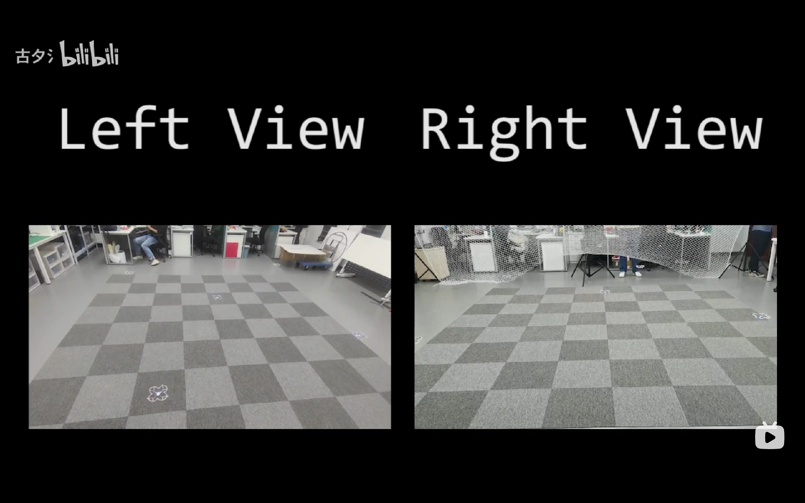

[](https://www.bilibili.com/video/BV1mP4y1V7gY?spm_id_from=333.999.0.0)

# uav_greedy_snake

Use multi-uav to imitate the game of greedy snake

## Prerequisites and dependecies

### Ubuntu 18.04

```
git clone git@github.com:whoenig/crazyflie_ros.git
```
### External pose
Any motion capture system is avaliable to the project. The interface between MoCap and ROS is:
```
git clone git@github.com:ros-drivers/vrpn_client_ros.git
```

## Build

```
mkdir ~/catkin_ws/src
cd ~/catkin_ws/src
catkin_init_workspace

git clone git@github.com:zhang-hply/uav_greedy_snake.git

cd ~/catkin_ws/
catkin build
```
## Usage

```
roslaunch crazyflie_show trajectory_tracking_one.launch
```
